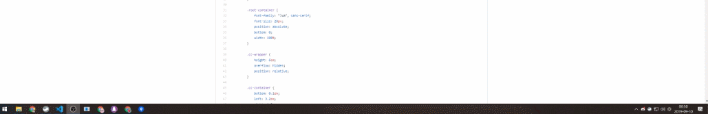

# Open Captions Overlay



Open Captions Overlay는 자막을 방송 송출 프로그램(OBS, XSplit 등)에 표시하기 위한 서비스입니다.

이 서비스을 사용하면 마이크를 통해 말한 내용을 방송 화면에 실시간으로 자막처럼 표시할 수 있습니다.

이 프로젝트는 [Closed Captions for Streams](https://www.twitch.tv/ext/xxwoffr2lnpxrgpq228mawvdgxetip)에서 영감을 받아 제작되었습니다.

[데모 동영상](https://youtu.be/CAIVO6aMgs4)

## 사용방법

### 1. 음성 인식 설정

1. [음성 인식 사이트](https://cc-overlay.update.sh/recognition)에 "최신 버전 크롬"으로 접속합니다.
2. 음성 인식 사이트에 방송하고자 하는 트위치 계정으로 로그인합니다.
3. 음성 인식 사이트의 `인식 시작` 버튼을 클릭하고 마이크 사용 권한을 허용합니다.
4. 음성 인식 사이트에서 마이크에 말한 내용을 인식한 내용이 출력되는 것을 확인합니다.

마이크에 말한 내용이 정상적으로 인식되어 사이트에 출력된다면, 음성 인식 설정을 모두 완료한 것입니다.

### 2. 방송 송출 프로그램 설정

#### 3.1. OBS Studio

1. [음성 인식 사이트](https://cc-overlay.update.sh/recognition)에서 표시되는 `오버레이 주소`를 OBS에 "브라우저" 소스의 URL로 등록합니다.
2. 캔버스 크기 1280x720에서 권장하는 브라우저 소스 너비와 높이는 840, 210입니다.

#### 3.1. XSplit Broadcaster

1. [음성 인식 사이트](https://cc-overlay.update.sh/recognition)에서 표시되는 `오버레이 주소`를 웹 페이지 소스 추가 창에서 URL로 등록합니다.
2. 캔버스 크기 1280x720에서 권장하는 브라우저 소스 너비와 높이는 840, 210입니다.

### 4. 설정 마무리

해당 설정을 완료한 후, 실제 방송에서 자막을 사용하시고자 할 때에는 [음성 인식 사이트](https://cc-overlay.update.sh/recognition)에 접속하셔서 `인식 시작` 버튼을 클릭하시면 됩니다.

만약 사용을 종료하시려면 음성 인식 사이트의 `인식 종료` 버튼을 클릭하거나 창을 종료합니다.

## 커스터마이징

### 1. 오버레이에 표시되는 프로필 이미지 변경

방송 송출 프로그램에서 Open Captions Overlay 브라우저 소스의 CSS에 다음 내용을 추가합니다.

```css
:root {
    --profile-url: url(https://i.postimg.cc/Qtsn3rc7/profile.png);
}
```

여기서 `https://i.postimg.cc/Qtsn3rc7/profile.png` 값을 변경할 프로필 이미지의 URL로 변경해주세요.

(이미지 URL은 [postimages.org](https://postimages.org/)와 같은 이미지 호스팅 서비스를 통해 생성할 수 있습니다.)

### 2. 오버레이에 표시되는 강조 색상 변경

방송 송출 프로그램에서 Open Captions Overlay 브라우저 소스의 CSS에 다음 내용을 추가합니다.

```css
:root {
    --accent-color: #95BBDF;
}
```

여기서 `#95BBDF` 값을 변경할 강조 색상 코드로 변경해주세요.

### 3. 오버레이의 바탕이 투명하지 않은 경우
방송 송출 프로그램에서 Open Captions Overlay 브라우저 소스의 CSS에 다음 내용을 추가합니다.

```css
body {
    background: transparent;
}
```

## Development

이하의 내용은 일반 사용자가 아닌 개발자를 위한 내용입니다.

### Init project

```
docker-compose run --rm backend python manage.py db upgrade
```

### Reinstall dependencies

```
docker-compose run --rm backend pipenv lock --pre
docker-compose build --force-rm
```

## License

본 프로젝트는 [MIT License](./LICENSE) 하에 제공됩니다.
